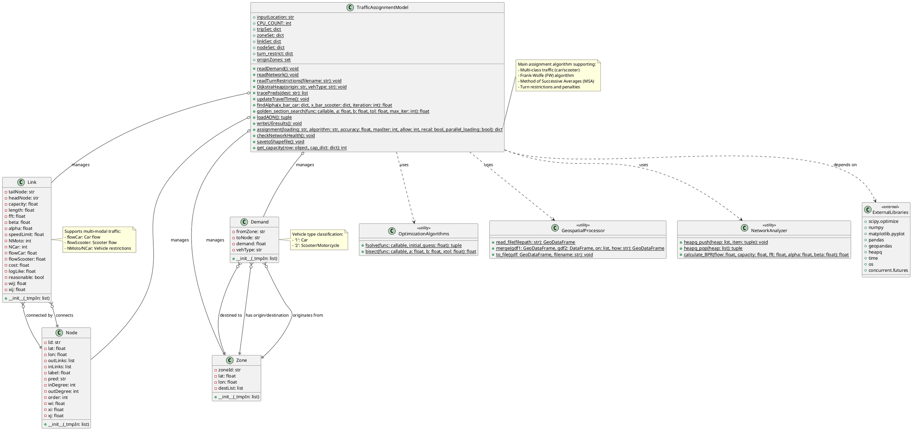

# Traffic Assignment Model - UML Class Diagram

## Class Diagram (PlantUML)

## Class Descriptions

### Core Data Classes

#### Zone
- 代表交通分析區域 (Traffic Analysis Zone, TAZ)
- 儲存區域ID及其目的地清單
- 座標資訊用於地理定位

#### Node
- 交通網路中的節點 (路口、端點)
- 包含Dijkstra演算法所需的標籤和前驅節點
- 支援Dial演算法的權重計算

#### Link
- 交通網路中的連結 (道路段)
- 支援多車種流量 (汽車/機車)
- 包含BPR函數參數用於旅行時間計算
- 車種禁行設定 (NMoto, NCar)

#### Demand
- OD需求矩陣的基本單元
- 包含車種資訊支援多車種指派

### Main Controller Class

#### TrafficAssignmentModel
- 主要的交通指派模型類別
- 實作Frank-Wolfe演算法和MSA方法
- 支援多車種交通指派
- 處理轉向限制和懲罰
- 整合地理資訊系統輸出

### Key Features

1. **多車種支援**: 同時處理汽車和機車的交通指派
2. **演算法選擇**: 支援Frank-Wolfe和MSA演算法
3. **轉向限制**: 處理禁止轉向和機車兩段式左轉
4. **地理資訊整合**: 支援Shapefile格式的網路資料
5. **效能優化**: 使用Heap-based Dijkstra和多執行緒處理

## Methods Summary

### 主要演算法方法
- `DijkstraHeap()`: 多車種最短路徑演算法
- `loadAON()`: All-or-Nothing交通量載入
- `findAlpha()`: 線性搜尋找最佳步長
- `assignment()`: 主要交通指派演算法

### 資料處理方法
- `readDemand()`: 讀取OD需求資料
- `readNetwork()`: 讀取道路網路資料
- `readTurnRestrictions()`: 讀取轉向限制資料
- `savetoShapefile()`: 輸出結果至GIS格式

### 輔助方法
- `updateTravelTime()`: 使用BPR函數更新旅行時間
- `checkNetworkHealth()`: 檢查網路連通性
- `tracePreds()`: 回溯最短路徑
